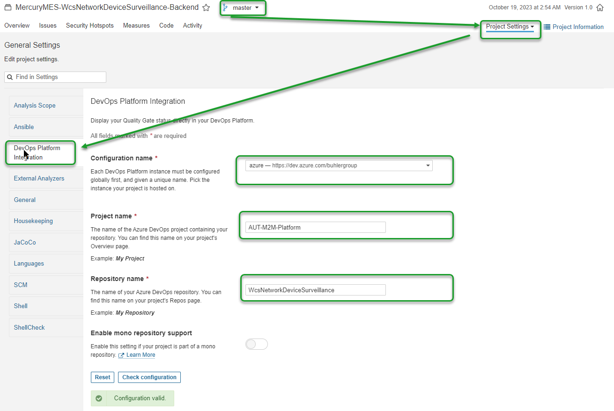

# SonarQube

SonarQube ist ein leistungsstarkes Tool zur statischen Codeanalyse, das die Codequalität und Sicherheit von Softwareprojekten automatisch überprüft. Es unterstützt zahlreiche Programmiersprachen und hilft Entwicklungsteams, Bugs, Sicherheitslücken und Code-Smells frühzeitig zu erkennen und zu beheben.

### Was kann man mit SonarQube machen?

* 🔍 Analyse von Codequalität, Bugs und Code Smells
* 🔐 Erkennung von Sicherheitslücken und Schwachstellen
* 📊 Übersichtliche Code-Metriken und Dashboards
* ✅ Qualitäts-Gates zur Einhaltung von Standards
* 🔄 Unterstützung für Refactoring und sauberen Code
* ⚙️ Integration in CI/CD-Pipelines (z. B. GitHub, Jenkins, Azure DevOps)

### Wie kann in Bühler zu einem Zugang zu SonarQube kommen?

Über [https://sonar.alm.buhlergroup.com/projects](https://sonar.alm.buhlergroup.com/projects) kommt man zur Bühler Instanz von SonarQube.&#x20;

Man wird aber noch keine Projekte sehen. Dafür muss man eine Anfrage über den ServiceDesk machen. Dafür gibt es zwei Mail Vorlagen:

**Für neue Integration**:

```
Subject: ALM
Dear ALM Team

I would like to use SonarQube for my project:
Name of the project in Azure DevOps:
Name of the project in SonarQube (recommendation: same as Azure DevOps project name):
Are you already using pipelines: yes/no

Best Regards,
```

**Für User Access**

```
Subject: ALM
Dear ALM Team

I would like to grant the following users to SonarQube:
- Username

Please remove the access for following users to SonarQube:
- Username

Information to SonarQube:
 - Project Name:

Best Regards,
```

### Wie und wann wird SonarQube im Entwicklungs-Prozess eingebunden?

SonarQube sollte in allen Softwareentwicklungs-Umgebungen eingebunden werden. SonarQube wird in der Pipeline integriert so das bei jedem Durchlauf,getestet werden kann.&#x20;

Um eine Rückmeldung als **Quality-Gate** für Build-Pipelines in Azure DevOps zu ermöglichen, muss die Integration für jedes Projekt wie im folgenden Bild konfiguriert werden:

<figure><figcaption></figcaption></figure>


